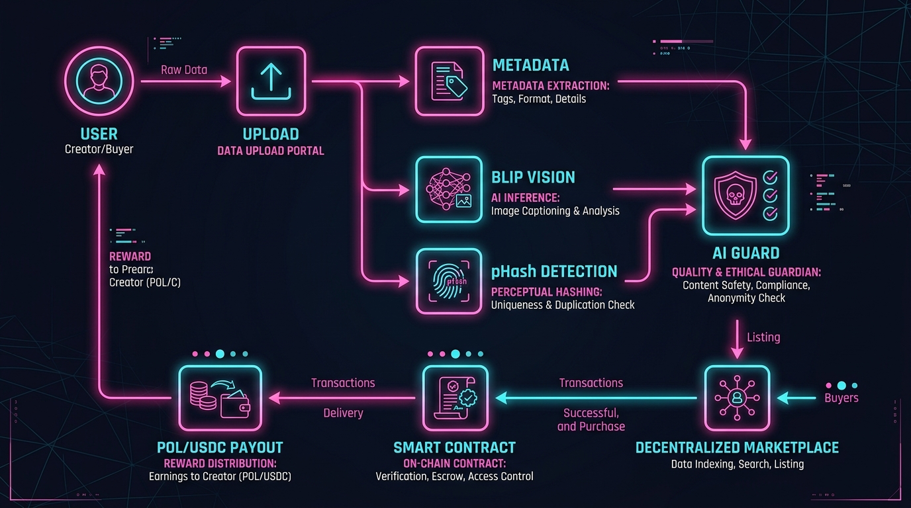
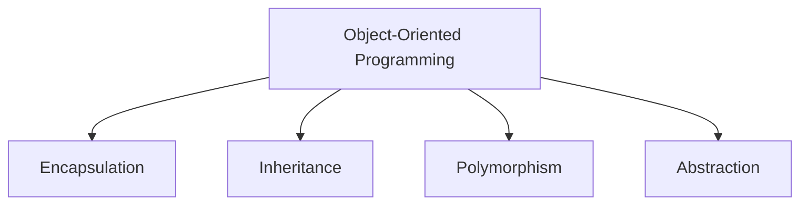
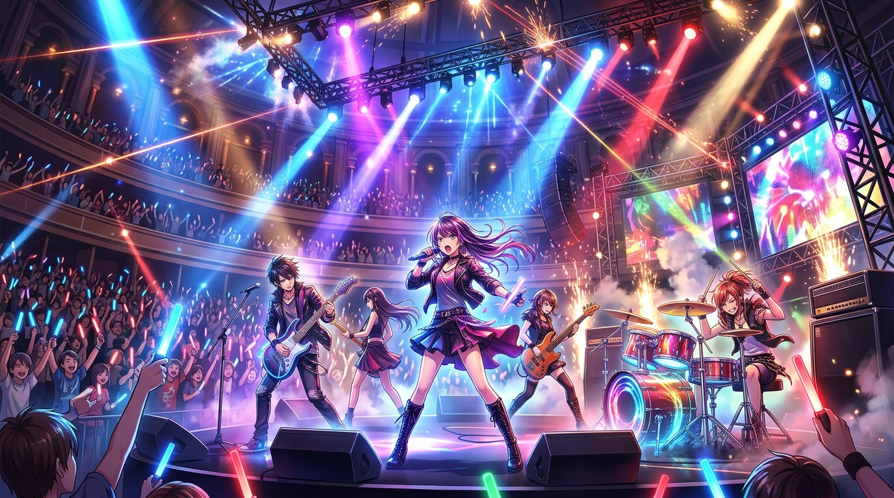

<div align="center">

<!-- ========================================================= -->
<!--                         HERO                              -->
<!-- ========================================================= -->


<br><br>

# MAROOF HUSAIN
### `< Computer Science Student />` · `< Problem Solver />` · `< Builder />`

<br>


<br><br>

<!-- ========================================================= -->
<!--                     SOCIAL LINKS                          -->
<!-- ========================================================= -->

<a href="https://github.com/Gkchvcg">
  
</a>
<a href="https://www.linkedin.com/in/maroof-husain-arima/">
  
</a>
<a href="https://leetcode.com/u/MaroofHusain/">
  
</a>

<br><br>

<a href="https://github.com/Gkchvcg?tab=repositories">
  
</a>


<br><br>


</div>

---

<div align="center">

## 🧠 ABOUT ME

I am a Computer Science student driven by the desire to build resilient, elegant systems. My technical interests sit around:

**Algorithms** · **Data Structures** · **Mathematics** · **Software Engineering** · **System Design**<br>
**Artificial Intelligence** · **Machine Learning** · **Data Analytics** · **Full Stack Development** · **Blockchain / Web3**

> *"I prefer understanding why things work rather than simply memorizing how to use them."*

</div>

<br>

<div align="center">

</div>

---

<div align="center">

## 🎼 CODE × MUSIC × MATHEMATICS

<br>


<br><br>

**Logic** ➜ Structure<br>
**Mathematics** ➜ Precision<br>
**Music** ➜ Rhythm<br>
**Engineering** ➜ Systems

</div>

---

<div align="center">

## 🧩 DATA STRUCTURES & ALGORITHMS


<br><br>

| Core Concepts | Advanced Patterns | Trees & Graphs | DP & Optimization |
|:---:|:---:|:---:|:---:|
| Arrays & Strings | Prefix Sum & Diff Array | Binary Trees | 1D & 2D DP |
| Two Pointers | Monotonic Stack | Graph Traversals (BFS/DFS) | Greedy Algorithms |
| Sliding Window | Deque & Heaps | Dijkstra's Algorithm | Backtracking |
| Binary Search | KMP & Z Algorithm | DSU (Disjoint Set) | Bit Manipulation |
| Linked Lists | Hashing & Intervals | Shortest Paths | Subsets & Permutations |

</div>

<br>

<div align="center">

</div>

---

<div align="center">

## 🧮 MATHEMATICS

</div>

Mathematics forms the foundational logic behind algorithm optimization and system modeling. Areas I am continuously studying include:

<div align="center">

| Algebra & Calculus | Probability & Stats | Number Theory & Logic |
|:---:|:---:|:---:|
| Functions & Sequences | Conditional Probability | GCD / LCM & Sieve |
| Inequalities & Logarithms | Bayes Theorem | Modular Arithmetic |
| Combinatorics (nCr, nPr) | Expected Value | Graph Theory |
| Recurrence Relations | Random Variables | Prime Numbers |

<br>

**Useful Formulas:**

$$ \gcd(a,b) = \gcd(b, a \bmod b) $$
$$ \binom{n}{r} = \frac{n!}{r!(n-r)!} $$
$$ P(A|B) = \frac{P(A \cap B)}{P(B)} $$
$$ E[X] = \sum xP(X=x) $$

</div>

<br>

<div align="center">

</div>

---

<div align="center">

## 🛠️ COMPLETE TECHNOLOGY STACK

<br>

### 💻 Programming Languages


### 🌐 Frontend & UI


### ⚙️ Backend & Frameworks


### 🗄️ Databases


### 🤖 AI / ML & Data Analytics

<br>


<br>
*Computer Vision · NLP · AI Agents · Recommendation Systems*

### 🔗 Developer Tools

<br>
*JIRA · Travis CI · PyCharm*

### 🔐 Blockchain / Web3

<br>
*Smart Contracts · POL · USDC*

</div>

<br>

<div align="center">

</div>

---

<div align="center">

## 🚀 FEATURED PROJECT: DataKart
### *"The Global Data Aggregation Engine"*

DataKart is a decentralized, AI-powered data marketplace designed for data discovery, verification, and exchange.

<br>



<br>

</div>

**Core Features & Systems:**
- **AI Processing Engine:** Powered by Llama for AI matchmaking and Karty AI Assistant.
- **Vision AI:** Uses BLIP for automated image tagging and metadata extraction.
- **AI Data Guard:** Implements pHash duplicate prevention and NSFW detection to secure the marketplace.
- **Web3 Ecosystem:** Handles decentralized marketplace transactions via Smart Contracts with POL and USDC payouts.

---

<div align="center">

## 🤖 ARTIFICIAL INTELLIGENCE & DATA ANALYTICS

<br>

**AI / ML Projects & Concepts Explored:**
- Autonomous Research Agent
- AI Fact-Checking Platform
- AI Medical Assistant
- Fake News Detector
- Recommendation Systems

<br>

**Data Analytics Focus:**
- Data Collection · Data Cleaning · EDA · Statistics · Visualization
- Regression Modeling · Machine Learning Data Pipelines
- Customer Churn Analysis · Retail Sales Intelligence · Movie Recommendation System

</div>

<br>

<div align="center">

</div>

---

<div align="center">

## 🏗️ SYSTEM DESIGN & OOP

</div>

**System Architecture & Design:**
Scalability · Reliability · Monolith vs Microservices · Load Balancing · Caching · CDN · Database Replication & Sharding · Message Queues · REST APIs · Distributed Systems · CAP Theorem · Consistency & Fault Tolerance

<br>

<div align="center">



</div>

**Java / OOP Expertise:**
Classes & Objects · Interfaces & Generics · Collections Framework · Exception Handling · Multithreading · JVM Internals · Memory Management

<br>

<div align="center">

</div>

---

<div align="center">

## 📊 GITHUB ACTIVITY

<br>


</div>

---

<div align="center">

## 🎯 CURRENT FOCUS

| 🧠 DSA | Σ MATHEMATICS | 🏗️ SYSTEMS | 🤖 AI / ML |
|:---:|:---:|:---:|:---:|
| Patterns & Logic | Algebra | Architecture | AI Agents |
| Dynamic Programming | Probability | Databases | Machine Learning |
| Graph Algorithms | Combinatorics | Scalability | Computer Vision |
| Greedy Algorithms | Number Theory | Distributed Systems | LLMs & NLP |
| Recursion | Graph Theory | OOP Paradigms | Data Analytics |

</div>

<br>

<div align="center">

</div>

---

<div align="center">

## 🧭 ENGINEERING MINDSET

**UNDERSTAND** ➜ **MODEL** ➜ **BREAK DOWN** ➜ **FIND PATTERN** ➜ **DESIGN** ➜ **IMPLEMENT** ➜ **TEST** ➜ **OPTIMIZE** ➜ **LEARN**

<br>

</div>

---

<div align="center">

<!-- ========================================================= -->
<!--                         FINAL                             -->
<!-- ========================================================= -->


<br><br>

### `Code × Mathematics × Music × Engineering`

```java
while (alive) {
    learn();
    build();
    fail();
    debug();
    improve();
}
```

<br><br>

<a href="https://github.com/Gkchvcg">
  
</a>
<a href="https://www.linkedin.com/in/maroof-husain-arima/">
  
</a>
<a href="https://leetcode.com/u/MaroofHusain/">
  
</a>

<br><br>

*Keep learning. Keep building.*

</div>
